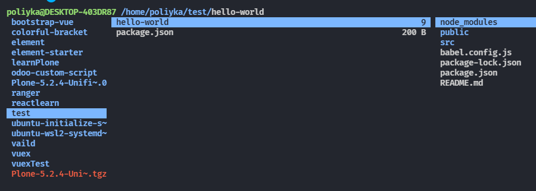
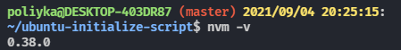
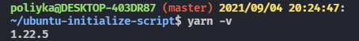
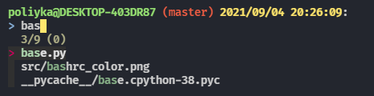
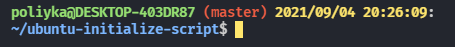
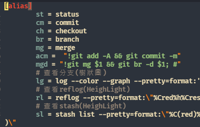

# Ubuntu 20.04 初始化腳本

這個腳本停止開發，轉移到 golang 版本: [https://github.com/poliyka/ubuntuInit](https://github.com/poliyka/ubuntuInit)

## Configuration

- [install.sh](./install.sh) 選擇需要的套件

```python
...
#--------------------------------------------------
# Choose Dependencise
#--------------------------------------------------
UPDATE_SERVER="True"
INSTALL_DEPENDEN="True"

# Choices Packages
INSTALL_RANGER="True"
INSTALL_NVM="True"
INSTALL_YARN="True"
INSTALL_PYENV="True"
INSTALL_FZF="True"
CONFIG_BASHRC_COLOR="True"
CONFIG_GIT_ALIAS="True"
...
```

## Usage

```h
sudo ./install.sh
```

安裝完成後

```h
source ~/.bashrc
```

## Introduction

- INSTALL_RANGER

  快速瀏覽料夾工具, 啟動方式在 Terminal 中輸入 `ranger`



- INSTALL_NVM

  前端 npm 版本管理工具



- INSTALL_YARN

  前端 yarn package manager



- INSTALL_FZF

  快速查詢檔案功能,快速鍵 `ctrl+t`



- CONFIG_BASHRC_COLOR

  客製化 `bash` 指令



- CONFIG_GIT_ALIAS

  客製化 `git` 指令



## Notice

1. 不要重複安裝相同的套件，否則會產生 Garbage Code.
2. 如有要安裝特定版本請自行修改腳本
